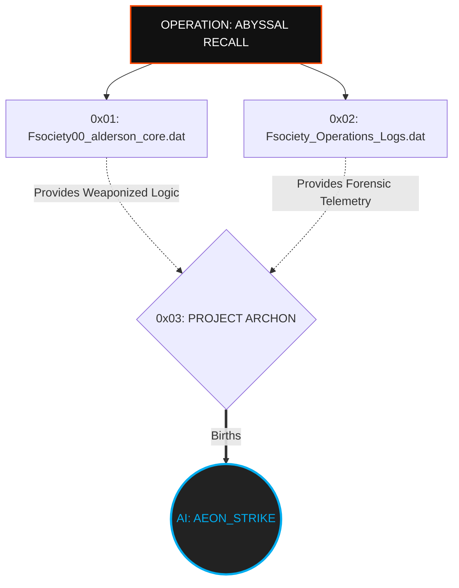

<p align="center">
  
</p>

<p align="center">
<pre>
<font color="#FF4646">███████╗</font><font color="#FFFFFF">███████╗ ██████╗  ██████╗██╗███████╗████████╗██╗   ██╗</font>
<font color="#FF4646">██╔════╝</font><font color="#FFFFFF">██╔════╝██╔═══██╗██╔════╝██║██╔════╝╚══██╔══╝╚██╗ ██╔╝</font>
<font color="#FF4646">█████╗  </font><font color="#FFFFFF">███████╗██║   ██║██║     ██║█████╗     ██║    ╚████╔╝ </font>
<font color="#FF4646">██╔══╝  </font><font color="#FFFFFF">╚════██║██║   ██║██║     ██║██╔══╝     ██║     ╚██╔╝  </font>
<font color="#FF4646">██║     </font><font color="#FFFFFF">███████║╚██████╔╝╚██████╗██║███████╗   ██║      ██║   </font>
<font color="#FF4646">╚═╝     </font><font color="#FFFFFF">╚══════╝ ╚═════╝  ╚═════╝╚═╝╚══════╝   ╚═╝      ╚═╝   </font>
</pre>
</p>

<div align="center">

# <samp>Fsociety00_alderson_core.dat</samp>

**<samp>The Central Nervous System | Advanced Red Team Weaponized Arsenal</samp>**

<br>

<samp>Architect: <a href="https://github.com/fsoc-ghost-0x">C0deGhost</a> | Version: 2.0.0 (Abyssal) | Status: <font color="#00ff00">ACTIVE_OPERATIVE</font></samp>

</div>

<br>
<div align="center">
  
  <br>
  <samp><b>[ TACTICAL TELEMETRY: <font color="#ff4500">APT CLASSIFICATION</font> OFFICIALLY VERIFIED & ACTIVE ]</b></samp>
</div>
<br>

<div align="center">


</div>

---

<details open>
<summary><code>[+] Decrypting Alderson Core Directory...</code></summary>

- [▌ 0x01_MISSION_MANIFESTO (ABYSSAL RECALL)](#-0x01_mission_manifesto_abyssal_recall)
- [▌ 0x02_ARSENAL_MATRIX (THE GRID)](#-0x02_arsenal_matrix_the_grid)
- [▌ 0x03_PROJECT_ARCHON_ROADMAP](#-0x03_project_archon_roadmap)
- [▌ 0x04_DEPLOYMENT_PROTOCOL](#-0x04_deployment_protocol)
- [▌ 0x05_LEGAL_DISCLAIMER](#-0x05_legal_disclaimer)

</details>

<br>

## <samp>▌ <u>0x01_MISSION_MANIFESTO_ABYSSAL_RECALL</u></samp>

<samp>
Hello, friend. Let's talk about the world they built for you. 
</samp>

<samp>
Most people live in a delusion of security. This repository is the reality check. <code>Fsociety00_alderson_core.dat</code> is not a standard script kiddie repository; it is an <b>Offensive Arsenal Architect</b> framework. It is the kinetic arm of a massive, overarching initiative known as <b>FSOCIETY_OPERATION: ABYSSAL_RECALL</b>. 
</samp>

<samp>
Designed by the FSOCIETY Red Team, this project encompasses military-grade offensive development, polymorphic malware engineering, and Advanced Persistent Threat (APT) methodologies. We do not publish standard Proof of Concepts (PoCs). We engineer highly sophisticated, persistent, and stealthy vectors aimed at one singular goal: <b>Total Domain Dominance.</b> 
</samp>

<samp>
<b>The Operational Doctrine:</b>
</samp>

- <samp><b>Silence is Power:</b> Implants and payloads engineered to bypass modern EDR/AV solutions, utilizing Ring-0 subversion and in-memory execution.</samp>
- <samp><b>Weaponized Logic:</b> From customized Exploit Kits for buffer overflows to Active Directory liquidation scripts.</samp>
- <samp><b>Control is an Illusion:</b> We don't ask for permission; we take the root.</samp>

<div align="center">
  <br>
  <i><font color="#ff4500" face="monospace">"We are ghosts in a world of zeroes. We are the 1."</font></i>
</div>

<br>

## <samp>▌ <u>0x02_ARSENAL_MATRIX_THE_GRID</u></samp>

<samp>The tactical matrix of this repository is organized into surgical sub-sectors. Each sector represents a specific vector in the cyber kill-chain.</samp>

| <samp>Sector</samp> | <samp>Category</samp> | <samp>Description</samp> | <samp>Intel_Level</samp> |
| :--- | :--- | :--- | :--- |
| <samp><code>/exploits</code></samp> | <samp>Custom & Weaponized</samp> | <samp>Polymorphic exploits, Exploit Kits, and personalized PoCs.</samp> | <samp>Ring-3 to 0</samp> |
| <samp><code>/LPE</code></samp> | <samp>Privilege Escalation</samp> | <samp>Local vectors to transition from user to #root / SYSTEM.</samp> | <samp>SYSTEM_ROOT</samp> |
| <samp><code>/windows</code></samp> | <samp>Win-Offensive</samp> | <samp>AD Exploits, GPO Abuse, and C#/.ps1 Weaponization.</samp> | <samp>DOMAIN_ADMIN</samp> |
| <samp><code>/linux</code></samp> | <samp>Linux-Offensive</samp> | <samp>Kernel exploits, GTFOBins, SUID abuse, and Ring-0 subversion.</samp> | <samp>KERNEL_SPACE</samp> |
| <samp><code>/malware</code></samp> | <samp>Malware Engineering</samp> | <samp>Backdoors, Trojans, and Advanced Persistence Mechanisms.</samp> | <samp>APT_GRADE</samp> |
| <samp><code>/low-level</code></samp> | <samp>Kernel & Memory</samp> | <samp>Buffer overflows, heap sprays, and binary pwnage.</samp> | <samp>MEMORY_CORRUPT</samp> |
| <samp><code>/automation</code></samp> | <samp>Surgical Scripts</samp> | <samp>Python and Bash scripts for rapid campaign deployment.</samp> | <samp>RAPID_DEPLOY</samp> |
| <samp><code>/shells</code></samp> | <samp>Reverse & Bind</samp> | <samp>Encrypted tunnels and stealthy callback mechanisms.</samp> | <samp>FORENSIC_GHOST</samp> |
| <samp><code>/web</code></samp> | <samp>Application Security</samp> | <samp>Advanced SQLi, LFI/RFI, and logic flaw weaponization.</samp> | <samp>WEB_INFRA</samp> |
| <samp><code>/ai-ops</code></samp> | <samp>AI Red Teaming</samp> | <samp>Adversarial ML, Prompt Injection, and LLM Exploitation.</samp> | <samp>NEXUS_CORE</samp> |
| <samp><code>/tools</code></samp> | <samp>Fsociety Tools</samp> | <samp>Custom binaries for pivoting, exfiltration, and recon.</samp> | <samp>FIELD_SUPPORT</samp> |
| <samp><code>/cve-arch</code></samp> | <samp>Vulnerability Archive</samp> | <samp>Documented and ready-to-fire CVE implementations.</samp> | <samp>READY_TO_FIRE</samp> |

<br>

## <samp>▌ <u>0x03_PROJECT_ARCHON_ROADMAP</u></samp>

<samp>This repository is only the beginning. <b>FSOCIETY_OPERATION: ABYSSAL_RECALL</b> is a multi-year initiative designed to fundamentally alter the landscape of offensive security. The operation consists of three intertwined pillars:</samp>



<samp>
<b>[ PROJECT_ARCHON : AI_AEON_STRIKE ]</b><br>
Over the next 3-5 years, the tools developed in <i>Alderson_core</i> and the real-world intrusion telemetry documented in <i>Operations_Logs</i> will be fed into a centralized machine learning matrix. The ultimate goal is the birth of <b>AEON_STRIKE</b>—an autonomous Offensive AI capable of full-chain execution, Zero-Day discovery, and silent network subversion without human intervention. 

We are not just writing code; we are training the apex predator of the digital ecosystem.
</samp>

<br>

## <samp>▌ <u>0x04_DEPLOYMENT_PROTOCOL</u></samp>

<details>
  <summary><code>[+] View Initialization Sequence...</code></summary>
  
  ### <samp>1. Cloning the Core</samp>
  ```bash
  git clone https://github.com/fsoc-ghost-0x/Fsociety00_alderson_core.dat.git
  cd Fsociety00_alderson_core.dat
  ```

  ### <samp>2. Initializing Environment</samp>
  <samp>Ensure all dependencies are isolated to prevent cross-contamination.</samp>
  
  ```bash
  python3 -m venv .vault
  source .vault/bin/activate
  pip install -r requirements.txt
  ```
  
</details>

<br>

## <samp>▌ <u>0x05_LEGAL_DISCLAIMER</u></samp>
<samp>
All data, scripts, and logic provided in this repository are for authorized penetration testing, Red Teaming engagements, and educational research only. Unauthorized access to computer systems is a felony. FSOCIETY and its operators are not responsible for the misuse of the armaments contained herein. You are solely responsible for your actions.
</samp>

<br>

<div align="center">
<i><font color="#888888" face="monospace">"Control is an illusion. Data is the only truth."</font></i>
</div>

---

<p align="center">
  <samp><strong><font color="#ff4500">WE ARE FSOCIETY. WE ARE FINALLY FREE. WE ARE FINALLY AWAKE.</font></strong></samp>
</p>
