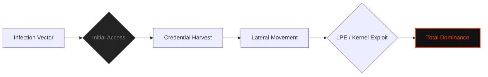

  

<pre>
███████╗███████╗ ██████╗  ██████╗██╗███████╗████████╗██╗   ██╗
██╔════╝██╔════╝██╔═══██╗██╔════╝██║██╔════╝╚══██╔══╝╚██╗ ██╔╝
█████╗  ███████╗██║   ██║██║     ██║█████╗     ██║    ╚████╔╝ 
██╔══╝  ╚════██║██║   ██║██║     ██║██╔══╝     ██║     ╚██╔╝  
██║     ███████║╚██████╔╝╚██████╗██║███████╗   ██║      ██║   
╚═╝     ╚══════╝ ╚═════╝  ╚═════╝╚═╝╚══════╝   ╚═╝      ╚═╝   
</pre>

# <samp>C0deGhost.sh --internal</samp>

**<samp>Lead Offensive Developer | Red Team Operator | Digital Forensic Architect</samp>**

 

<samp>Identity: C0deGhost | Status: ACTIVE_OPERATIVE | Authorization: LEVEL_5_CLEARANCE</samp>

---

<code>Decrypting Full Intelligence Dossier...</code>

- [▌ 0x01_INTERNAL_MONOLOGUE](#-0x01_internal_monologue)
- [▌ 0x02_OPERATOR_DATA_DOSSIER](#-0x02_operator_data_dossier)
- [▌ 0x03_TECHNICAL_CAPABILITIES_MATRIX](#-0x03_technical_capabilities_matrix)
- [▌ 0x04_OFFENSIVE_ARSENAL_STACK](#-0x04_offensive_arsenal_stack)
- [▌ 0x05_OPERATIONAL_FOOTPRINT](#-0x05_operational_footprint)
- [▌ 0x06_LEGAL_DISCLAIMER](#-0x06_legal_disclaimer)

 

## <samp>▌ <u>0x01_INTERNAL_MONOLOGUE</u></samp>

  
<code>Accessing Manifesto...</code>

  
  <samp>
  Hello, friend. 
  
  Most people look for a door. I look for the gaps between the bricks. Ethical hacker by day, shadow architect by night. I am an offensive security researcher passionate about the physics of failure—breaking complex systems to understand how to rebuild them stronger.
  
  I operate in the intersection between raw binary and psychological subversion. Specialist in dismantling infrastructures, weaponizing logic flaws, and maintaining absolute invisibility. Whether I'm deploying a kernel exploit from a high-end workstation or pivoting through a network from a non-rooted mobile terminal, the objective remains the same: **Total Domain Dominance.**
  </samp>

  

     
    <i>"Breaking systems is a science; fixing them is an art."</i>
  

 

 

## <samp>▌ <u>0x02_OPERATOR_DATA_DOSSIER</u></samp>

  
<code>Decrypting Full Intelligence Dossier...</code>

### <samp>▌ Operational Environments & Stealth</samp>

- **<samp>Offensive & Forensic Platforms:</samp>**
  - <samp><code>Kali Linux & Parrot OS</code>: Primary hardened environments for full-scale Red Team engagements.</samp>
  - <samp><code>Arch Linux</code>: Custom-built, minimal footprint OS for specialized exploitation R&D.</samp>

- **<samp>Stealth & Anonymity (Anti-Forensics):</samp>**
  - <samp><code>Tails & Whonix</code>: Advanced traffic routing (Tor/I2P) and zero-trace operational security.</samp>
  - <samp><code>Live Mode Operation</code>: Expert execution in volatile memory (RAM-only) to bypass disk-based forensic analysis.</samp>

- **<samp>Mobile Warfare & Remote Ops:</samp>**
  - <samp><code>Termux Hacking</code>: High-proficiency in ARM-based exploitation and pivoting from non-rooted environments.</samp>
  - <samp><code>Kali NetHunter</code>: Mobile-first physical intrusion, wireless attacks, and HID/BadUSB delivery.</samp>
  - <samp><code>Field Strategy</code>: "Living off the Land" in degraded environments—executing kill-chains without persistent storage.</samp>

### <samp>▌ Offensive Development & Analysis</samp>

- **<samp>Malware Engineering (0x01.1):</samp>**
  - <samp>Development of custom malware, shellcoding, and advanced polymorphic payloads.</samp>
  - <samp>Advanced AV/EDR/Firewall bypass and custom persistence mechanisms.</samp>

- **<samp>Defensive Analysis & Forensics (0x04):</samp>**
  - <samp>Incident Response, evidence recovery, and static/dynamic malware dissection.</samp>
  - <samp>Vulnerability discovery through secure code auditing and mitigation PoC creation.</samp>

### <samp>▌ Hardware & Niche Domains (0x05)</samp>

- **<samp>Hardware Hacking:</samp>**
  - <samp>Physical device exploitation, firmware dumping, and wireless network infiltration.</samp>
- **<samp>FinTech Security:</samp>**
  - <samp>Crypto-asset hacking and blockchain-level vulnerability research.</samp>
- **<samp>Mobile Security:</samp>**
  - <samp>Advanced Termux pentesting and mobile application (Android/iOS) security auditing.</samp>

## <samp>▌ <u>0x03_TECHNICAL_CAPABILITIES_MATRIX</u></samp>

| <samp>Sector</samp> | <samp>Specialization</samp> | <samp>Clearance Level</samp> |
| :--- | :--- | :--- |
| <samp><code>Exploitation</code></samp> | <samp>Malware Engineering & Custom Shellcoding</samp> | <samp>BLACK_HAT_LEVEL</samp> |
| <samp><code>Infrastructure</code></samp> | <samp>Active Directory Dominance & ADCS Abuse</samp> | <samp>DOMAIN_ADMIN</samp> |
| <samp><code>Cloud/Web</code></samp> | <samp>API Security & Insecure Deserialization</samp> | <samp>ADVANCED</samp> |
| <samp><code>Low-Level</code></samp> | <samp>Kernel-land Research & Buffer Overflows</samp> | <samp>SYSTEM_ROOT</samp> |
| <samp><code>Forensics</code></samp> | <samp>Evidence Recovery & Malware Dissection</samp> | <samp>INVESTIGATOR</samp> |

 

## <samp>▌ <u>0x04_OFFENSIVE_ARSENAL_STACK</u></samp>

<samp>Languages of Subversion:</samp> 

 

<samp>Tactical Hardware & Tooling:</samp> 

 

---

### <samp>Visual Attack Flow (Operational Mindset)</samp>

 

## <samp>▌ <u>0x05_OPERATIONAL_FOOTPRINT</u></samp>

<samp>Direct Access to Encrypted Data Streams:</samp>

 

<samp><i>Primary contact through encrypted metadata in repository logs.</i></samp>

 

## <samp>▌ <u>0x04_THE_NEXUS: CUSTOM_AI_ORCHESTRATION</u></samp>

  
<code>Accessing AI Framework Status...</code>

 

**<samp>[!] Status: OPERATIONAL | Role: Lead AI Architect & Operator</samp>**

 

> <samp><b>[+] FENRIR | Web Exploitation Engine</b></samp>
> - <samp>Specialization: Advanced Web App Auditing (CVE, Zero-Days, Tech Stack Analysis).</samp>
> - <samp>Capabilities: Custom Exploits, Payloads, Web-shells, and Advanced Backdoors.</samp>

 

> <samp><b>[+] MR. BAKER | Forensic & Reverse Engineering Specialist</b></samp>
> - <samp>Specialization: Low-Level, Kernel Analysis, and Anti-Forensics.</samp>
> - <samp>Scope: Cross-platform (Android, iOS, Windows, Linux) and Mobile Sandbox Evasion.</samp>

 

> <samp><b>[+] TERMINUS | Linux Exploitation & LPE</b></samp>
> - <samp>Specialization: Deep Linux Environment compromise and Post-Exploitation.</samp>
> - <samp>Capabilities: Automated LPE Research and Custom Kernel-Space Exploits.</samp>

 

> <samp><b>[+] SPECTRE | Windows & Active Directory Dominance</b></samp>
> - <samp>Specialization: AD Infrastructure, DC takeover, and Windows Internals.</samp>
> - <samp>Capabilities: EDR/AV evasion payloads and Domain persistence mechanisms.</samp>

 

> <samp><b>[+] VERITAS | Offensive Reporting & Intelligence Architect</b></samp>
> - <samp>Specialization: Transforming raw operational logs into high-impact strategic intelligence.</samp>
> - <samp>Impact: Automated synthesis of complex exploit chains into professional Technical/Executive reports.</samp>

 

> <samp><b>[+] KAGE | Advanced Buffer Overflow & Binary Exploitation</b></samp>
> - <samp>Specialization: Memory corruption, Reverse Engineering, and Shellcode Engineering.</samp>
> - <samp>Scope: x64/x86 architectures, binary analysis, and server-side exploitation.</samp>

 

**<samp>[!] UNDER DEVELOPMENT: [REDACTED] | Advanced Static/Dynamic Code Auditing & Vuln Discovery Engine.</samp>**

## <samp>▌ <u>0x06_LEGAL_DISCLAIMER</u></samp>
<samp>
All data provided in this profile is for authorized security research and professional exhibition only. C0deGhost and the Fsociety team operate within legal frameworks of engagement. Unauthorized use of the knowledge contained here will be prosecuted. 
</samp>
 
<i>"Control is an illusion. Data is the only truth."</i>

---

  <samp><strong>WE ARE FSOCIETY. WE ARE FINALLY FREE. WE ARE FINALLY AWAKE.</strong></samp>

