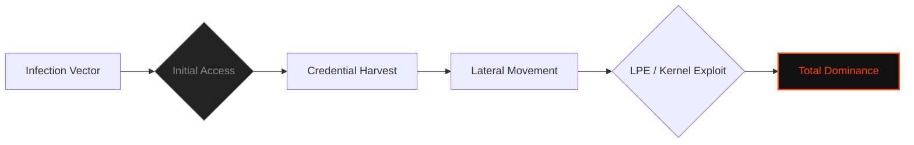

  

<pre>
███████╗███████╗ ██████╗  ██████╗██╗███████╗████████╗██╗   ██╗
██╔════╝██╔════╝██╔═══██╗██╔════╝██║██╔════╝╚══██╔══╝╚██╗ ██╔╝
█████╗  ███████╗██║   ██║██║     ██║█████╗     ██║    ╚████╔╝ 
██╔══╝  ╚════██║██║   ██║██║     ██║██╔══╝     ██║     ╚██╔╝  
██║     ███████║╚██████╔╝╚██████╗██║███████╗   ██║      ██║   
╚═╝     ╚══════╝ ╚═════╝  ╚═════╝╚═╝╚══════╝   ╚═╝      ╚═╝   
</pre>

# <samp>C0deGhost.sh --internal</samp>

**<samp>Lead Offensive Developer | Red Team Operator | Digital Forensic Architect</samp>**

 

<samp>Identity: C0deGhost | Status: ACTIVE_OPERATIVE | Authorization: LEVEL_5_CLEARANCE</samp>

<table border="0" cellspacing="0" cellpadding="0">
  <tr>
    <td align="center" valign="middle">
      
    </td>
    <td align="center" valign="middle">
      
    </td>
  </tr>
  <tr>
    <td colspan="2" align="center">
      <samp><i>Telemetry verification: HOLO Operator Status Confirmed</i></samp>
    </td>
  </tr>
</table>

 

  
   
  <samp><b>[ TACTICAL TELEMETRY: APT CLASSIFICATION OFFICIALLY VERIFIED & ACTIVE ]</b></samp>

 

## <samp>▌ <u>0x00_TABLE_CONTENT</u></samp>

<code>Decrypting Full Intelligence Dossier...</code>

 

- [▌ 0x01_INTERNAL_MONOLOGUE](#-0x01_internal_monologue)
- [▌ 0x02_OPERATOR_DATA_DOSSIER](#-0x02_operator_data_dossier)
- [▌ 0x03_TECHNICAL_CAPABILITIES_MATRIX](#-0x03_technical_capabilities_matrix)
- [▌ 0x04_OFFENSIVE_ARSENAL_STACK](#-0x04_offensive_arsenal_stack)
- [▌ 0x05_OPERATIONAL_FOOTPRINT](#-0x05_operational_footprint)
- [▌ 0x05.1_THE_NEXUS: CUSTOM_AI_ORCHESTRATION](#-0x051_the_nexus-custom_ai_orchestration)
- [▌ 0x05.2_PROYECTS_FSOCIETY_CURRENTS](#-0x052_projects-current_operations)
- [▌ 0x06_LEGAL_DISCLAIMER](#-0x06_legal_disclaimer)

 

## <samp>▌ <u>0x01_INTERNAL_MONOLOGUE</u></samp>

  
<code>Accessing Operator Manifesto...</code>

  
  ### <samp>The Operational Doctrine</samp>

  <samp>
  Hello, friend. 
  
  I am not here to participate in the charade of "ethical hacking" or to climb leaderboards in sandbox environments. I am an <strong>Offensive Security Operator</strong> | <strong>Red Team Lead</strong> <strong>(Fsociety)</strong>. I operate where the physics of failure intersect with psychological subversion. My focus is not on discovering bugs; it is on the weaponization of logic and the systematic liquidation of infrastructure security.
  
  Operating as an <strong>Independent APT</strong> | I bridge the gap between raw binary manipulation and strategic infrastructure takeover. From low-level kernel subversion to high-impact domain dominance, my tradecraft is designed for forensic invisibility. Whether maneuvering from a hardened high-end workstation or executing precision strikes from a non-rooted mobile terminal via <code>Termux/NetHunter</code>, the objective remains singular: <strong>Total Domain Compromise.</strong>
  
  I don't seek the light; I thrive in the dark-mode of the kernel. I am the architect of the shadow systems that govern your reality.
  </samp>

  

     
    <i>"Control is an illusion. I am the exploit."</i>
  

 

 

## <samp>▌ <u>0x02_OPERATOR_DATA_DOSSIER</u></samp>

  
<code>Decrypting Full Intelligence Dossier...</code>

### <samp>▌ Operational Environments & Stealth</samp>

- **<samp>Offensive & Forensic Platforms:</samp>**
  - <samp><code>Kali Linux & Parrot OS</code>: Primary hardened environments for full-scale Red Team engagements.</samp>
  - <samp><code>Arch Linux</code>: Custom-built, minimal footprint OS for specialized exploitation R&D.</samp>

- **<samp>Stealth & Anonymity (Anti-Forensics):</samp>**
  - <samp><code>Tails & Whonix</code>: Advanced traffic routing (Tor/I2P) and zero-trace operational security.</samp>
  - <samp><code>Live Mode Operation</code>: Expert execution in volatile memory (RAM-only) to bypass disk-based forensic analysis.</samp>

- **<samp>Mobile Warfare & Remote Ops:</samp>**
  - <samp><code>Termux Hacking</code>: High-proficiency in ARM-based exploitation and pivoting from non-rooted environments.</samp>
  - <samp><code>Kali NetHunter</code>: Mobile-first physical intrusion, wireless attacks, and HID/BadUSB delivery.</samp>
  - <samp><code>Field Strategy</code>: "Living off the Land" in degraded environments—executing kill-chains without persistent storage.</samp>

### <samp>▌ Offensive Development & Analysis</samp>

- **<samp>Malware Engineering (0x01.1):</samp>**
  - <samp>Development of custom malware, shellcoding, and advanced polymorphic payloads.</samp>
  - <samp>Advanced AV/EDR/Firewall bypass and custom persistence mechanisms.</samp>

- **<samp>Defensive Analysis & Forensics (0x04):</samp>**
  - <samp>Incident Response, evidence recovery, and static/dynamic malware dissection.</samp>
  - <samp>Vulnerability discovery through secure code auditing and mitigation PoC creation.</samp>

### <samp>▌ Hardware & Niche Domains (0x05)</samp>

- **<samp>Hardware Hacking:</samp>**
  - <samp>Physical device exploitation, firmware dumping, and wireless network infiltration.</samp>
- **<samp>FinTech Security:</samp>**
  - <samp>Crypto-asset hacking and blockchain-level vulnerability research.</samp>
- **<samp>Mobile Security:</samp>**
  - <samp>Advanced Termux pentesting and mobile application (Android/iOS) security auditing.</samp>

## <samp>▌ <u>0x03_TECHNICAL_CAPABILITIES_MATRIX</u></samp>

| <samp>Sector</samp> | <samp>Specialization</samp> | <samp>Clearance Level</samp> |
| :--- | :--- | :--- |
| <samp><code>Exploitation</code></samp> | <samp>Malware Engineering & Custom Shellcoding</samp> | <samp>BLACK_HAT_LEVEL</samp> |
| <samp><code>Infrastructure</code></samp> | <samp>Active Directory Dominance & ADCS Abuse</samp> | <samp>DOMAIN_ADMIN</samp> |
| <samp><code>Cloud/Web</code></samp> | <samp>API Security & Insecure Deserialization</samp> | <samp>ADVANCED</samp> |
| <samp><code>Low-Level</code></samp> | <samp>Kernel-land Research & Buffer Overflows</samp> | <samp>SYSTEM_ROOT</samp> |
| <samp><code>Forensics</code></samp> | <samp>Evidence Recovery & Malware Dissection</samp> | <samp>INVESTIGATOR</samp> |

 

## <samp>▌ <u>0x04_OFFENSIVE_ARSENAL_STACK</u></samp>

<samp>Languages of Subversion:</samp> 

 

<samp>Tactical Hardware & Tooling:</samp> 

 

---

### <samp>Visual Attack Flow (Operational Mindset)</samp>

 

## <samp>▌ <u>0x05_OPERATIONAL_FOOTPRINT</u></samp>

<samp>Direct Access to Encrypted Data Streams:</samp>

  

<!-- Visual Matrix: Operational Rank -->
<samp>[ SECTOR: RANK_VERIFICATION ]</samp> 

  

<!-- Visual Matrix: Operational Rank_Level -->
<samp>[ SECTOR: RANK_VERIFICATION_LEVEL ]</samp> 

  

<!-- Visual Matrix: Performance Metrics -->
<samp>[ SECTOR: OPERATIONAL_METRICS ]</samp> 

 

<samp><i>Primary contact through encrypted metadata in repository logs.</i></samp>

## <samp>▌ <u>0x05.1_THE_NEXUS: CUSTOM_AI_ORCHESTRATION</u></samp>

  
<code>Accessing AI Framework Status...</code>

  
 

**<samp>[!] Status: OPERATIONAL | Role: Lead AI Architect & Operator</samp>**

 

> <samp><b>[+] FENRIR | Web Exploitation Engine</b></samp>
> - <samp>Specialization: Advanced Web App Auditing (CVE, Zero-Days, Tech Stack Analysis).</samp>
> - <samp>Capabilities: Custom Exploits, Payloads, Web-shells, and Advanced Backdoors.</samp>

 

> <samp><b>[+] MR. BAKER | Forensic & Reverse Engineering Specialist</b></samp>
> - <samp>Specialization: Low-Level, Kernel Analysis, and Anti-Forensics.</samp>
> - <samp>Scope: Cross-platform (Android, iOS, Windows, Linux) and Mobile Sandbox Evasion.</samp>

 

> <samp><b>[+] TERMINUS | Linux Exploitation & LPE</b></samp>
> - <samp>Specialization: Deep Linux Environment compromise and Post-Exploitation.</samp>
> - <samp>Capabilities: Automated LPE Research and Custom Kernel-Space Exploits.</samp>

 

> <samp><b>[+] SPECTRE | Windows & Active Directory Dominance</b></samp>
> - <samp>Specialization: AD Infrastructure, DC takeover, and Windows Internals.</samp>
> - <samp>Capabilities: EDR/AV evasion payloads and Domain persistence mechanisms.</samp>

 

> <samp><b>[+] VERITAS | Offensive Reporting & Intelligence Architect</b></samp>
> - <samp>Specialization: Transforming raw operational logs into high-impact strategic intelligence.</samp>
> - <samp>Impact: Automated synthesis of complex exploit chains into professional Technical/Executive reports.</samp>

 

> <samp><b>[+] KAGE | Advanced Buffer Overflow & Binary Exploitation</b></samp>
> - <samp>Specialization: Memory corruption, Reverse Engineering, and Shellcode Engineering.</samp>
> - <samp>Scope: x64/x86 architectures, binary analysis, and server-side exploitation.</samp>

 

> <samp><b>[+] CIPHER_$ - AXION | Offensive Arsenal Architect & Subversion Master</b></samp>
> - <samp>Specialization: Low-Level Logic, Polymorphic Engineering, and Ring-0 Subversion.</samp>
> - <samp>Capabilities: Engineering stealthy implants, direct syscall injection, and runtime binary unhooking.</samp>
> - <samp>Focus: Creating weaponized logic designed to dismantle infrastructures from within by exploiting the mathematical reality of the processor.</samp>

 

> <samp><b>[+] PROXY | Tactical Orchestrator & APT Campaign Manager</b></samp>
> - <samp>Specialization: Operational Logistics, Red Team Playbooks, and Offensive Doctrine.</samp>
> - <samp>Capabilities: Syncing custom exploits with forensic anti-trace protocols, C2 infrastructure management, and high-level strategic intelligence synthesis.</samp>
> - <samp>Focus: Orchestrating complex kill-chains, managing campaign variables (LHOST/LPORT/Targets), and ensuring total domain dominance through systematic operational cycles.</samp>

 

**<samp>[!] UNDER DEVELOPMENT: [REDACTED] | Advanced Static/Dynamic Code Auditing & Vuln Discovery Engine.</samp>**

 
 

## <samp>▌ <u>0x05.2_PROJECTS: CURRENT_OPERATIONS</u></samp>

  
<code>Accessing Active Operation Repositories...</code>

 

<samp>The following sectors represent the core of my offensive lifecycle. From the development of polymorphic logic to the forensic documentation of real-world intrusions.</samp>

  

<!-- Project 01: The Arsenal -->
<table border="0" cellspacing="0" cellpadding="10" width="100%">
  <tr>
    <td width="350" align="center" valign="center">
      
    </td>
    <td align="left" valign="center">
      <h3><samp>Fsociety00_alderson_core.dat</samp></h3>
      <samp><b>[ THE ELITE ARSENAL ]</b></samp>  
      <samp>
        The central nervous system of weaponized logic. A curated repository of surgical exploits, Local Privilege Escalation (LPE) vectors, and specialized offensive tooling. 
          
        <i>Focus:</i> Weaponizing CVEs, Kernel-land exploitation, and custom malware engineering.
      </samp>
    </td>
  </tr>
</table>

 

<!-- Project 02: The Methodology -->
<table border="0" cellspacing="0" cellpadding="10" width="100%">
  <tr>
    <td align="left" valign="center">
      <h3><samp>Fsociety_Operations_Logs.dat</samp></h3>
      <samp><b>[ THE METHODOLOGY ]</b></samp>  
      <samp>
        The forensic blueprint of every intrusion. This sector archives the full lifecycle of my operations, including screen recordings, raw terminal logs, and technical/executive reports.
          
        <i>Contents:</i> Advanced machine writeups, vulnerability analysis, and step-by-step auditing methodologies.
      </samp>
    </td>
    <td width="350" align="center" valign="center">
      
    </td>
  </tr>
</table>

---

## <samp>▌ <u>0x06_LEGAL_DISCLAIMER</u></samp>
<samp>
All data provided in this profile is for authorized security research and professional exhibition only. C0deGhost and the Fsociety team operate within legal frameworks of engagement. Unauthorized use of the knowledge contained here will be prosecuted. 
</samp>
 
<i>"Control is an illusion. Data is the only truth."</i>

---

  <samp><strong>WE ARE FSOCIETY. WE ARE FINALLY FREE. WE ARE FINALLY AWAKE.</strong></samp>

